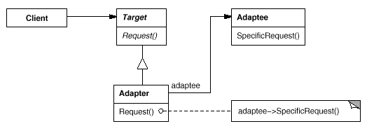

## 적응자 (Adapter / Wrapper)

### 동기
일치 하지 않는 인터페이스를 갖는 클래스들을 잘 통합하여 사용하고 싶음

### 구조
##### 클래스 적응자 : 상속

##### 객체 적응자 : 객체 합성

### 활용
- 이미 만든 것을 재사용하고자 하나 이 재사용한 라이브러리를 수정할 수 없을 때
- (**객체 적응자만 해당**) 이미 존재하는 여러 개의 서브클래스를 사용해야 하는데, 이 서브클래스들의 상속을 통해서 이들의 인터페이스를 다 개조하는 것이 현실 성이 없을 떄

### 참조
 - [Adapter Pattern  - Java](https://blog.seotory.com/post/2017/09/java-adapter-pattern)
 - [Adpater Pattern (Class - Java)](https://niceman.tistory.com/141)