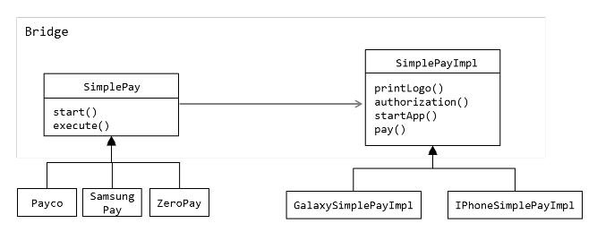
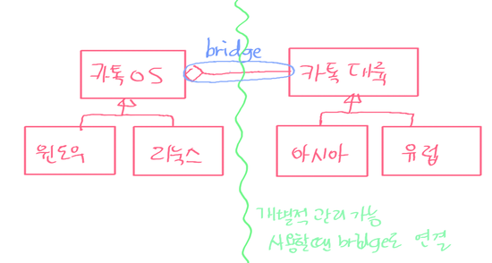

## 가교 (Bridge)

#구조

###활용예제
- ex1) 아래 경우와 비슷하게 library 구축에 많이 사용된다

- ex2)

### Bridge vs Adapter pattern
- Adapter패턴은 서로 관계가 없었던 클래스들을 **어느순간 필요에 의해** 서로 엮어주기 위해 사용하는것이고, Bridge패턴은 **애초에** 인터페이스와 구현을 서로 독립적으로 나누어 설계하기 위해 사용한다.
- 목적
  - Adapter: 이미 존재하고 있는 객체를 이용해서 다른 객체의 인터페이스를 만들어준다
  - Bridge: 인터페이스와 구현을 분리
- 설계
  - Adapter: 이미 존재하는 클래스를 어떻게 활용할것인가  
  - Bridge: 인터페이스와 구현이 서로 독립적으로 변경될수있게 처음부터 고려함
- 구현
  - Adapter: 구현클래스의 객체를 데이터 멤버로 반드시 가지고 있을 필요가 없다
  - Bridge: 항상 구현 클래스의 객체가 있어야 하고 이를 통해서만 구현이 이루어질 수 있다